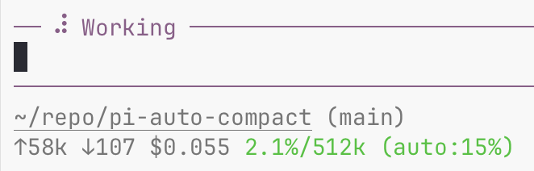
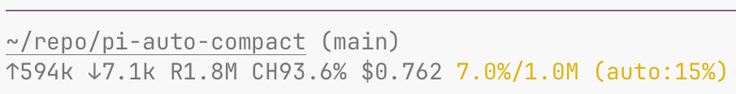
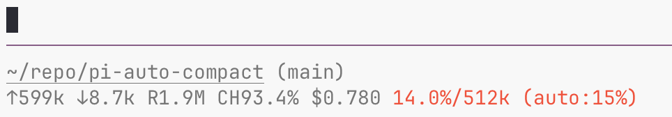

# @betterlmy/pi-auto-compact

**为 Pi Coding Agent 提供轻量的上下文保全与恢复辅助。**

[English](./README.md) | 简体中文

Pi 已有自动压缩、工具批次之间的压缩续行和超限恢复。本插件不把这些基础能力再包装成独有功能，而是在压缩前后增加几道防护：裁剪超长工具结果、提取当前分支的事实、清洗摘要输入，以及补回部分遗漏。

无需额外摘要模型、Python 或独立历史档案；默认使用当前会话模型生成摘要。**压缩仍然有损，防护的目标是降低风险，而不是保证信息永不丢失。**

## 安装

```bash
pi install npm:@betterlmy/pi-auto-compact

# 或从源码安装
pi install git:github.com/betterlmy/pi-auto-compact
```

安装后重启 Pi，或执行 `/reload`。npm 包要求 Pi `>=0.84.0`；各版本的原生调度能力可能不同，版本声明不代表对所有后续版本都已实测。

## 插件补充了什么

### 工具结果进入上下文前，限制超长文本

默认将单条工具结果的文本限制为 **50,000 字符**，保留首尾并标记省略部分。图片等非文本块不参与这个字符上限。

这能降低一次大日志输出挤满窗口的风险，但被截掉的中间内容不会由本插件另行归档。需要全文时，应让命令先输出到文件，再按需读取；设 `maxToolResultChars: 0` 可关闭裁剪。

### 摘要前，提取当前分支的事实与最近请求

插件从当前会话分支的原始记录中提取：

- `write` / `edit` 调用涉及的文件路径，最多 30 个。
- `read` 调用涉及的其他文件，最多 15 个。
- 最近去重后的 `bash` 命令，最多 8 条。
- 显式 `/goal` 或特定 goal 消息中的目标。
- 最近一条普通用户请求，最多保留 2,000 字符，超出时标记截断。

这些信息会加入摘要指令。**工具调用记录不等于执行成功，最近请求也不等于仍未完成的任务。** 这不是对所有工具、约束或任务意图的语义理解。

### 摘要请求清洗与预算控制

默认启用 `safeCompaction`，接管 `session_before_compact`，包括手动、原生自动和本插件发起的压缩：

- 不把 assistant 的 thinking 草稿序列化到摘要输入中。
- 限制摘要输入中的工具结果和工具参数长度。
- 将系统提示、旧摘要、事实、额外指令、历史文本及模型输出预留一起纳入估算预算。
- 历史超长时保留首尾片段并注明中部省略；固定提示、旧摘要或附加要求本身放不下时取消压缩，不静默裁掉它们。

预算使用 **3 字符约等于 1 token** 的估算，输入和输出合计控制在模型窗口的 70% 内；输出上限为模型输出能力与 4,096 tokens 中的较小值。**这不是精确 tokenizer，不能保证每个模型或提供商都不会超限。**

### 压缩后，做有限的遗漏检查

检查显式目标的关键词片段和调用涉及的修改文件路径；最近用户请求若未原样出现在摘要中，也会补回其有界原文。

补充消息参与模型上下文，但不触发新回合，也不在对话中展示。目标关键词检查是启发式的；目前不逐项核对命令、读取文件、所有约束或摘要的业务正确性。

## 什么时候压缩，什么时候继续

默认触发线是 **75%**，可按当前会话或全局调整：

| 场景 | 行为 |
| --- | --- |
| Agent 已完全空闲，且用量达到触发线 | 请求压缩；完成后保持空闲，不重启已结束任务 |
| 工具 turn 完成后，用量达到触发线 | 请求压缩；若成功后宿主仍空闲且没有排队输入，发送一次隐藏续跑消息 |
| 上述工具边界用量达到 **92%** | 使用紧急保全指令，要求摘要额外保留最后操作状态与下一步意图 |
| 摘要失败、为空、被输出上限截断或用户取消 | 取消压缩，不落地降级快照，不由本插件自动续跑 |

92% 是固定的紧急分类线，不是另一个始终独立生效的触发器。插件在工具执行完成后的边界检查，不会在工具运行到一半时抢先裁断它。

Pi 原生压缩仍可先触发，其阈值为 `contextWindow - reserveTokens`，并非固定 98%。原生重试与排队调度由 Pi 控制。`ctx.compact()` 路径可能中止当前 Agent run，续跑是一次新的模型回合，不是底层 run 的无缝延续。

### 失败时优先保留信息

安全摘要失败时，插件返回取消，不用事实清单替代完整摘要，也不提交半份检查点。**本次压缩不会替换旧上下文，但也不会因此释放空间。** 工具结果在更早阶段已发生的裁剪不会被撤销。

修复模型、网络或输入大小问题后，可执行 `/compact` 重试。若原来已经超限，可能仍需人工处理；插件不承诺自动解救所有卡住的会话。关闭 `safeCompaction` 后，摘要与失败处理交回 Pi 原生实现。

## 命令

| 命令 | 作用 |
| --- | --- |
| `/auto-compact` | 打开阈值输入框 |
| `/auto-compact 80` | 设置当前会话阈值；恢复该会话时保留 |
| `/auto-compact global 80` | 保存全局阈值，并让当前会话跟随全局 |
| `/auto-compact status` | 查看有效配置、失败策略及会话统计 |
| `/auto-compact footer` | 切换默认状态行和接管式 Footer |
| `/auto-compact progress` | 切换渐变配色与固定三档配色 |
| `/auto-compact setup` | 确认后开启原生压缩，并设置 50,000 tokens 响应预留及自动管理 |

阈值命令接受 10–99 的整数。不要把阈值设得过低：Pi 需要有足够的旧消息可供压缩，压缩本身也需要模型调用与窗口余量。

`setup` 不是通用最优配置：50,000 tokens 在 1M 窗口下约对应 95% 触发线，在 200K 窗口下约为 75%；小窗口尤其需要自行评估。默认不会修改 Pi 的主设置。

## 配置

配置文件：`~/.pi/agent/auto-compact.json`。

```json
{
  "threshold": 75,
  "customFooter": false,
  "progressColor": true,
  "autoManageSettings": false,
  "safeCompaction": true,
  "maxToolResultChars": 50000
}
```

| 字段 | 默认值 | 说明 |
| --- | --- | --- |
| `threshold` | `75` | 全局触发线；会话级阈值优先 |
| `customFooter` | `false` | 默认使用 `setStatus`；开启后替换 Footer |
| `progressColor` | `true` | 接管 Footer 中按反向对数曲线渐变配色，临近触发线加速 |
| `autoManageSettings` | `false` | 是否允许自动调整 Pi 主设置中的原生压缩配置 |
| `safeCompaction` | `true` | 摘要清洗、完整请求估算预算与失败取消策略 |
| `maxToolResultChars` | `50000` | 单条工具结果文本上限；`0` 关闭裁剪 |

压缩、裁剪及紧急处理次数记录在会话条目中，恢复会话后仍可查看。配置和统计不是独立的完整历史备份。

## 状态栏

默认显示 `compact: 75%`，不替换其他插件的 Footer。使用 `/auto-compact footer` 后，统计行可显示 `14.1%/1.0M (auto:75%)`，压缩期间显示 `(auto:compacting...)`。

渐变将 `t = 当前用量 ÷ 触发线` 钳制到 0–1，再按 `-log(1 - 0.9t) / log(10)` 取色：低用量保持偏绿，临近触发线时加速变黄、变红。约达到触发线的 76% 时为琥珀色，达到触发线后保持红色。它不改变实际压缩阈值，也不是单独的风险判定。关闭渐变后恢复固定三档：超过 90% 红色、超过 70% 黄色，其余蓝色。

以下截图保留旧版线性渐变示例，仅展示 Footer 布局与颜色端点，不代表当前曲线在相同用量下的精确颜色。

<p align="center">
  
</p>
<p align="center"><em>低用量</em></p>

<p align="center">
  
</p>
<p align="center"><em>琥珀色示例（旧版线性曲线）</em></p>

<p align="center">
  
</p>
<p align="center"><em>接近触发线</em></p>

## 使用边界与兼容性

- **适合**：希望在原生 Pi 上增加轻量的工具输出限制、分支事实辅助与摘要完整结束检查。
- **不是**：无损记忆系统、独立原始档案、后台审核器或前缀缓存加速器。
- 不建议同时启用多个接管 `session_before_compact` 的摘要插件；阈值命令或配置路径也可能与同名插件冲突。
- 默认状态行可与其他 UI 插件配合；开启接管 Footer 后需自行协调显示所有权。
- 插件会修改模型可见的工具结果和会话内容，并读写自己的配置与会话统计；只有明确开启自动管理或确认 `setup` 才会调整 Pi 主设置。它不修改项目业务文件。
- 摘要使用当前模型，消耗调用时间与 token；降低触发线可能增加压缩频率，也可能降低前缀缓存命中率。没有通用的成本节省保证。

## 开发

```bash
npm test
npm run typecheck
```

## 许可证

[MIT](./LICENSE)。设计思路参考了 `pi-smart-compact`（alpertarhan）与 `agent-context-guard-pi`（j1nn0）。
